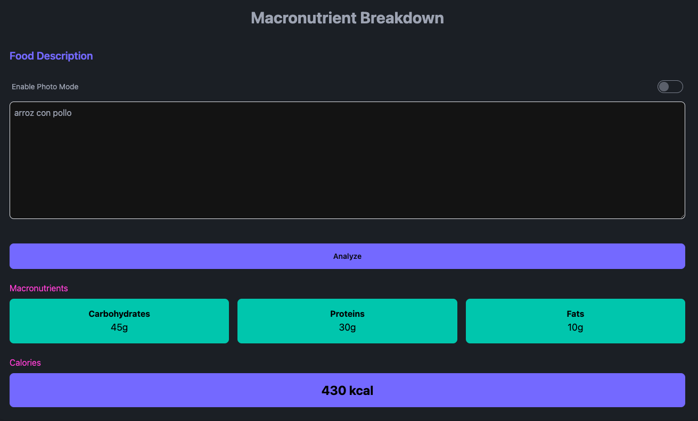
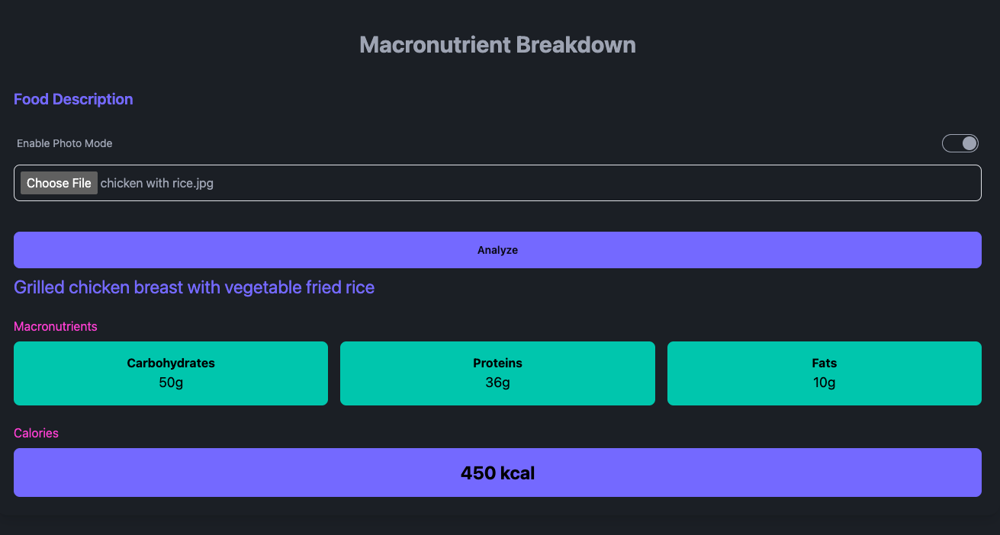

# Food Analyzer

Food Analyzer is a web application designed to provide estimated macronutrient breakdowns based on food descriptions or images. Utilizing a the food analysis API, this application can analyze the nutritional content of various foods, helping users make informed dietary decisions.

## Features

- Text Analysis: Users can enter a description of their meal, and the application will analyze the text to provide a nutritional breakdown.
  
  
- Image Analysis: For a more intuitive experience, users can upload an image of their meal. The application supports PNG and JPEG formats and includes image compression for efficient uploading.
  
  
- Nutrient Data: The application displays a estimated breakdown of macronutrients, including calories, fats, proteins, and carbohydrates.
- User-Friendly Interface: With a focus on simplicity and ease of use, the application offers a clean and straightforward UI, making food analysis accessible to everyone.

## Getting Started

To get a local copy up and running, follow these simple steps.

### Prerequisites

- Node.js
- npm

### Installation

1. Clone the repo
  ```
  git clone <repository-url>
  ```

2. Install NPM packages
  ```
  npm install
  ```

3. Start the application
  ```
  npm run dev
  ```

## Usage

1. Select Analysis Mode: Choose between text description and image upload for food analysis.
2. Enter Food Description or Upload an Image: Based on the selected mode, either type a description of your meal or upload an image.
3. Analyze: Click the analyze button to submit your input to the food analysis API.
4. View Results: The nutritional breakdown will be displayed, offering insights into the macronutrient content of your meal.

# Possible Improvements

- History of Analysis: Implement a feature to keep track of previous food analysis results, allowing users to review their past meals and nutritional breakdowns.
- Daily Target: Introduce a feature that allows users to set a daily macronutrient target based on the analysis results. This will enable better tracking and help users make more informed dietary decisions.
